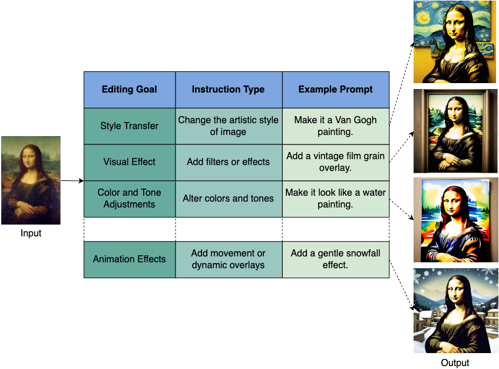

# Awesome Instruction Editing
A Survey of Instruction-Guided Image and Media Editing in LLM Era

[](https://awesome.re)
[](https://arxiv.org/abs/2411.09955)


A collection of academic articles, published methodology, and datasets on the subject of **Instruction-Guided Image and Media Editing**.

- [Instruction-Guided Editing Controls for Images and Multimedia: A Survey in LLM era](#awesome-instruction-editing)
    - [Existing Surveys](#existing-surveys)
  - [Taxonomy](#taxonomy)
  - [Approaches for Image Editing](#approaches-for-image-editing)
  - [Approaches for Media Editing](#approaches-for-media-editing)
  - [Datasets](#datasets)
    - [Type: General](#type-general)
    - [Type: Image Captioning](#type-image-captioning)
    - [Type: ClipArt](#type-clipart)
    - [Type: VQA](#type-vqa)
    - [Type: Semantic Segmentation](#type-semantic-segmentation)
    - [Type: Object Classification](#type-object-classification)
    - [Type: Depth Estimation](#type-depth-estimation)
    - [Type: Aesthetic-Based Editing](#type-aesthetic-based-editing)
    - [Type: Dialog-Based Editing](#type-dialog-based-editing)
  - [Evaluation Metrics](#evaluation-metrics)

A sortable version is available here: https://awesome-instruction-editing.github.io/

## 🔖 News!!!

📌 We are actively tracking the **latest research** and welcome contributions to our repository and survey paper. If your studies are relevant, please feel free to create an issue or a pull request.

📰 2024-11-15: Our paper **Instruction-Guided Editing Controls for Images and Multimedia: A Survey in LLM era** has been revised into version 1 with new methods and dicussions.

## 🔍 Citation

If you find this work helpful in your research, welcome to cite the paper and give a ⭐.

Please read and cite our paper: [](https://arxiv.org/abs/2411.09955)

>Nguyen, T.T., Ren, Z., Pham, T., Huynh, T.T., Nguyen, P.L., Yin, H., and Nguyen, Q.V.H., 2024. Instruction-Guided Editing Controls for Images and Multimedia: A Survey in LLM Era. arXiv preprint arXiv:2411.09955.

```
@article{nguyen2024instruction,
  title={Instruction-Guided Editing Controls for Images and Multimedia: A Survey in LLM era},
  author={Thanh Tam Nguyen and Zhao Ren and Trinh Pham and Thanh Trung Huynh and Phi Le Nguyen and Hongzhi Yin and Quoc Viet Hung Nguyen},
  journal={arXiv preprint arXiv:2411.09955},
  year={2024}
}
```

----------

## Existing Surveys
| **Paper Title** | **Venue** | **Year** | **Focus** |
| --------------- | ---- | ---- | ---- |
| [A Survey of Multimodal Composite Editing and Retrieval](https://arxiv.org/abs/2409.05405) | arXiv | 2024 |  Media Retrieval  |
| [INFOBENCH: Evaluating Instruction Following Ability in Large Language Models](https://arxiv.org/abs/2401.03601) | arXiv | 2024 |  Text Editing  |
| [Multimodal Image Synthesis and Editing: The Generative AI Era](https://ieeexplore.ieee.org/abstract/document/10230895) | TPAMI | 2023 | X-to-Image Generation |
| [LLM-driven Instruction Following: Progresses and Concerns](https://aclanthology.org/2023.emnlp-tutorial.4/) | EMNLP | 2023 |  Text Editing  |

----------

## Pipeline

[](https://arxiv.org/abs/2411.09955)

----------

## Approaches for Image Editing

| **Title** | **Year** | **Venue** | **Category** | **Code** |
| -------|------|-------|----------|------|
| <mark>[Guiding Instruction-based Image Editing via Multimodal Large Language Models](https://openreview.net/forum?id=S1RKWSyZ2Y)</mark> | 2024 | ICLR | LLM-guided, Diffusion, Concise instruction loss, Supervised fine-tuning | [Code](https://mllm-ie.github.io/) | 
| <mark>[Hive: Harnessing human feedback for instructional visual editing](https://arxiv.org/abs/2303.09618)</mark> | 2024 | CVPR | RLHF, Diffusion, Data augmentation | [Code](https://shugerdou.github.io/hive/) | 
| <mark>[InstructBrush: Learning Attention-based Instruction Optimization for Image Editing](https://arxiv.org/abs/2403.18660)</mark> | 2024 | arXiv | Diffusion, Attention-based | [Code](https://royzhao926.github.io/InstructBrush/) | 
| [FlexEdit: Flexible and Controllable Diffusion-based Object-centric Image Editing](https://arxiv.org/abs/2403.18605) | 2024 | arXiv | Controllable diffusion | [Code](https://flex-edit.github.io/) | 
| [Pix2Pix-OnTheFly: Leveraging LLMs for Instruction-Guided Image Editing](https://arxiv.org/abs/2403.08004) | 2024 | arXiv | on-the-fly, tuning-free, training-free | [Code](https://github.com/pix2pixzero/pix2pix-zero) | 
| [EffiVED:Efficient Video Editing via Text-instruction Diffusion Models](https://arxiv.org/abs/2403.11568) | 2024 | arXiv | Video editing, decoupled classifier-free | [Code](https://github.com/alibaba/EffiVED) | 
| [Grounded-Instruct-Pix2Pix: Improving Instruction Based Image Editing with Automatic Target Grounding](https://ieeexplore.ieee.org/abstract/document/10446377?casa_token=MC0if_Usl14AAAAA:UDH2NgPvWRYaaM0z_XOYFHxE_FQEIW2zHhw-k3AK6eKCMjEl6i2eESPi15qL0kZV6SgjM3Mp_8c) | 2024 | ICASSP | Diffusion, mask generation image editing | [Code](https://github.com/arthur-71/Grounded-Instruct-Pix2Pix) | 
| [TexFit: Text-Driven Fashion Image Editing with Diffusion Models](https://ojs.aaai.org/index.php/AAAI/article/view/28885) | 2024 | AAAI | Fashion editing, region locaation, diffusion | [Code](https://texfit.github.io/) | 
| <mark>[InstructGIE: Towards Generalizable Image Editing](https://arxiv.org/abs/2403.05018)</mark> | 2024 | arXiv | Diffusion, context matching |  [Code](https://github.com/cr8br0ze/InstructGIE-Code) | 
| [An Item is Worth a Prompt: Versatile Image Editing with Disentangled Control](https://arxiv.org/abs/2403.04880) | 2024 | arXiv | Freestyle, Diffusion, Group attention | [Code](https://github.com/asFeng/d-edit) | 
| [Text-Driven Image Editing via Learnable Regions](https://arxiv.org/abs/2311.16432) | 2024 | CVPR | Region generation, diffusion, mask-free | [Code](https://yuanze-lin.me/LearnableRegions_page/) | 
| [ChartReformer: Natural Language-Driven Chart Image Editing](https://arxiv.org/abs/2403.00209) | 2024 | ICDAR | chart editing | [Code](https://github.com/pengyu965/ChartReformer) | 
| [GANTASTIC: GAN-based Transfer of Interpretable Directions for Disentangled Image Editing in Text-to-Image Diffusion Models](https://arxiv.org/abs/2403.19645) | 2024 | arXiv | Hybrid, direction transfer | [Code](https://gantastic.github.io/) | 
| [StyleBooth: Image Style Editing with Multimodal Instruction](https://arxiv.org/abs/2404.12154) | 2024 | arXiv | style editing, diffusion | [Code](https://ali-vilab.github.io/stylebooth-page/) | 
| [ZONE: Zero-Shot Instruction-Guided Local Editing](https://arxiv.org/abs/2312.16794) | 2024 | CVPR | Local editing, localisation | [Code](https://github.com/lsl001006/ZONE) | 
| [Inversion-Free Image Editing with Natural Language](https://arxiv.org/abs/2312.04965) | 2024 | CVPR | Consistent models, unified attention | [Code](https://sled-group.github.io/InfEdit/) | 
| [Focus on Your Instruction: Fine-grained and Multi-instruction Image Editing by Attention Modulation](https://arxiv.org/abs/2312.10113) | 2024 | CVPR | Diffusion, multi-instruction | [Code](https://github.com/guoqincode/Focus-on-Your-Instruction) | 
| [MoEController: Instruction-based Arbitrary Image Manipulation with Mixture-of-Expert Controllers](https://arxiv.org/abs/2309.04372) | 2024 | arXiv | MoE, LLM-powered | [Code](https://oppo-mente-lab.github.io/moe_controller/) | 
| [InstructCV: Instruction-Tuned Text-to-Image Diffusion Models as Vision Generalists](https://openreview.net/forum?id=Nu9mOSq7eH) | 2024 | ICLR | Diffusion, LLM-based, classifier-free | [Code](https://github.com/AlaaLab/InstructCV) | 
| <mark>[Iterative Multi-Granular Image Editing Using Diffusion Models](https://openaccess.thecvf.com/content/WACV2024/html/Joseph_Iterative_Multi-Granular_Image_Editing_Using_Diffusion_Models_WACV_2024_paper.html)</mark> | 2024 | WACV | Diffusion, Iterative editing |   | 
| [Dynamic Prompt Learning: Addressing Cross-Attention Leakage for Text-Based Image Editing](https://proceedings.neurips.cc/paper_files/paper/2023/hash/5321b1dabcd2be188d796c21b733e8c7-Abstract-Conference.html) | 2024 | NeurIPS | Diffusion, dynamic prompt | [Code](https://github.com/wangkai930418/DPL) | 
| [Object-Aware Inversion and Reassembly for Image Editing](https://openreview.net/forum?id=dpcVXiMlcv) | 2024 | ICLR | Diffusion, multi-object | [Code](https://aim-uofa.github.io/OIR-Diffusion/) | 
| [Zero-Shot Video Editing Using Off-The-Shelf Image Diffusion Models](https://arxiv.org/abs/2303.17599) | 2024 | arXiv | video editing, zero-shot | [Code](https://github.com/baaivision/vid2vid-zero) | 
| [Video-P2P: Video Editing with Cross-attention Control](https://openaccess.thecvf.com/content/CVPR2024/html/Liu_Video-P2P_Video_Editing_with_Cross-attention_Control_CVPR_2024_paper.html) | 2024 | CVPR | Decoupled-guidance attention control, video editing | [Code](https://video-p2p.github.io/) | 
| <mark>[NeRF-Insert: 3D Local Editing with Multimodal Control Signals](https://arxiv.org/abs/2404.19204)</mark> | 2024 | arXiv | 3D Editing |   | 
| [BlenderAlchemy: Editing 3D Graphics with Vision-Language Models](https://arxiv.org/abs/2404.17672) | 2024 | arXiv | 3D Editing | [Code](https://ianhuang0630.github.io/BlenderAlchemyWeb/) | 
| <mark>[AudioScenic: Audio-Driven Video Scene Editing](https://arxiv.org/abs/2404.16581)</mark> | 2024 | arXiv | audio-based instruction |   | 
| [LocInv: Localization-aware Inversion for Text-Guided Image Editing](https://arxiv.org/abs/2405.01496) | 2024 | CVPR-AI4CC | Localization-aware inversion | [Code](https://github.com/wangkai930418/DPL) | 
| <mark>[SonicDiffusion: Audio-Driven Image Generation and Editing with Pretrained Diffusion Models](https://arxiv.org/abs/2405.00878)</mark> | 2024 | arXiv | Audio-driven | [Code](https://cyberiada.github.io/SonicDiffusion/) | 
| <mark>[Exploring Text-Guided Single Image Editing for Remote Sensing Images](https://arxiv.org/abs/2405.05769)</mark> | 2024 | arXiv | Remote sensing images | [Code](https://github.com/HIT-PhilipHan/remote_sensing_image_editing) | 
| <mark>[GaussianVTON: 3D Human Virtual Try-ON via Multi-Stage Gaussian Splatting Editing with Image Prompting](https://arxiv.org/abs/2405.07472)</mark> | 2024 | arXiv | Fashion editing | [Code](https://haroldchen19.github.io/gsvton/) | 
| <mark>[TIE: Revolutionizing Text-based Image Editing for Complex-Prompt Following and High-Fidelity Editing](https://arxiv.org/abs/2405.16803)</mark> | 2024 | arXiv | Chain of thought |   | 
| [Unified Editing of Panorama, 3D Scenes, and Videos Through Disentangled Self-Attention Injection](https://arxiv.org/abs/2405.16823) | 2024 | arXiv | Diffusion, Self-attention Injection | [Code](https://unifyediting.github.io/) | 
| <mark>[Instruct-MusicGen: Unlocking Text-to-Music Editing for Music Language Models via Instruction Tuning](https://arxiv.org/abs/2405.18386)</mark> | 2024 | arXiv | Music editing, diffusion | [Code](https://github.com/ldzhangyx/instruct-musicgen) | 
| <mark>[Text Guided Image Editing with Automatic Concept Locating and Forgetting](https://arxiv.org/abs/2405.19708)</mark> | 2024 | arXiv | Diffusion, concept forgetting |   | 
| [InstructPix2Pix: Learning To Follow Image Editing Instruction](https://openaccess.thecvf.com/content/CVPR2023/html/Brooks_InstructPix2Pix_Learning_To_Follow_Image_Editing_Instructions_CVPR_2023_paper.html) | 2023 | CVPR | Core paper, Diffusion | [Code](https://www.timothybrooks.com/instruct-pix2pix) | 
| [Visual Instruction Inversion: Image Editing via Image Prompting](https://proceedings.neurips.cc/paper_files/paper/2023/hash/1e75f7539cbde5de895fab238ff42519-Abstract-Conference.html) | 2023 | NeurIPS | Diffusion, visual instruction | [Code](https://thaoshibe.github.io/visii/) | 
| [Instruct-NeRF2NeRF: Editing 3D Scenes with Instructions](https://openaccess.thecvf.com/content/ICCV2023/html/Haque_Instruct-NeRF2NeRF_Editing_3D_Scenes_with_Instructions_ICCV_2023_paper.html) | 2023 | ICCV | 3D scene editing | [Code](https://instruct-nerf2nerf.github.io/) | 
| [Instruct 3D-to-3D: Text Instruction Guided 3D-to-3D conversion](https://arxiv.org/abs/2303.15780) | 2023 | arXiv | 3D editing, Dynamic scaling | [Code](https://sony.github.io/Instruct3Dto3D-doc/) | 
| <mark>[InstructME: An Instruction Guided Music Edit And Remix Framework with Latent Diffusion Models](https://arxiv.org/abs/2308.14360)</mark> | 2023 | arXiv | Music editing, diffusion | [Code](https://musicedit.github.io/) | 
| <mark>[EditShield: Protecting Unauthorized Image Editing by Instruction-guided Diffusion Models](https://arxiv.org/abs/2311.12066)</mark> | 2023 | arXiv | authorized editing, diffusion | [Code](https://github.com/Allen-piexl/Editshield) | 
| [Fairy: Fast Parallelized Instruction-Guided Video-to-Video Synthesis](https://arxiv.org/abs/2312.13834) | 2023 | arXiv | Video editing, cross-time attention | [Code](https://fairy-video2video.github.io/) | 
| [AUDIT: Audio Editing by Following Instructions with Latent Diffusion Models](https://proceedings.neurips.cc/paper_files/paper/2023/hash/e1b619a9e241606a23eb21767f16cf81-Abstract-Conference.html) | 2023 | NeurIPS | Audio, Diffusion | [Code](https://audit-demo.github.io/) | 
| [InstructAny2Pix: Flexible Visual Editing via Multimodal Instruction Following](https://arxiv.org/abs/2312.06738) | 2023 | arXiv | Refinement prior, instrucitonal tuning | [Code](https://github.com/jacklishufan/InstructAny2Pix) | 
| <mark>[Learning to Follow Object-Centric Image Editing Instructions Faithfully](https://aclanthology.org/2023.findings-emnlp.646/)</mark> | 2023 | EMNLP | Diffusion, additional supervision | [Code](https://github.com/tuhinjubcse/FaithfulEdits_EMNLP2023) | 
| <mark>[StableVideo: Text-driven Consistency-aware Diffusion Video Editing](https://openaccess.thecvf.com/content/ICCV2023/html/Chai_StableVideo_Text-driven_Consistency-aware_Diffusion_Video_Editing_ICCV_2023_paper.html)</mark> | 2023 | ICCV | Diffusion, Video | [Code](https://github.com/rese1f/StableVideo) | 
| <mark>[Vox-E: Text-Guided Voxel Editing of 3D Objects](https://openaccess.thecvf.com/content/ICCV2023/html/Sella_Vox-E_Text-Guided_Voxel_Editing_of_3D_Objects_ICCV_2023_paper.html)</mark> | 2023 | ICCV | Diffusion, 3D | [Code](https://tau-vailab.github.io/Vox-E/) | 
| <mark>[Unitune: Text-driven image editing by fine tuning a diffusion model on a single image](https://dl.acm.org/doi/abs/10.1145/3592451?casa_token=bP4wcwQMYtAAAAAA:pOEZ75vYUTT0vBV3ksAOSgXbHdbD8JFv4PQp56yVpuZ9brVDo8lB2Qozfy16Du9qVGfcG_u6j06B)</mark> | 2023 | TOG | Diffusion, fine-tuning | [Code](https://github.com/xuduo35/UniTune) | 
| <mark>[Dreamix: Video Diffusion Models are General Video Editors](https://arxiv.org/abs/2302.01329)</mark> | 2023 | arXiv | Cascaded diffusion, video | [Code](https://dreamix-video-editing.github.io/) | 
| <mark>[Dialogpaint: A dialog-based image editing model](https://arxiv.org/abs/2303.10073)</mark> | 2023 | arXiv | Dialog-based |   | 
| <mark>[iEdit: Localised Text-guided Image Editing with Weak Supervision](https://arxiv.org/abs/2305.05947)</mark> | 2023 | arXiv | Localized diffusion |   | 
| <mark>[ImageBrush: Learning Visual In-Context Instructions for Exemplar-Based Image Manipulation](https://proceedings.neurips.cc/paper_files/paper/2023/hash/98530736e5d94e62b689dfc1fda89bd1-Abstract-Conference.html)</mark> | 2023 | NeurIPS | Example-based instruction |   | 
| <mark>[NULL-Text Inversion for Editing Real Images Using Guided Diffusion Models](https://openaccess.thecvf.com/content/CVPR2023/papers/Mokady_NULL-Text_Inversion_for_Editing_Real_Images_Using_Guided_Diffusion_Models_CVPR_2023_paper.pdf)</mark> | 2023 | CVPR | null-tex embedding, Diffusion, CLIP | [Code](https://null-text-inversion.github.io/) | 
| [Imagic: Text-based real image editing with diffusion models](http://openaccess.thecvf.com/content/CVPR2023/html/Kawar_Imagic_Text-Based_Real_Image_Editing_With_Diffusion_Models_CVPR_2023_paper.html) | 2023 | CVPR | Diffusion, embedding interpolation | [Code](https://imagic-editing.github.io/) | 
| [PhotoVerse: Tuning-Free Image Customization with Text-to-Image Diffusion Models](https://arxiv.org/abs/2309.05793) | 2023 | arXiv | Diffusion, dual-branch concept | [Code](https://photoverse2d.github.io/) | 
| [InstructEdit: Improving Automatic Masks for Diffusion-based Image Editing With User Instructions](https://arxiv.org/abs/2305.18047) | 2023 | arXiv | Diffusion, LLM-powered | [Code](https://qianwangx.github.io/InstructEdit/) | 
| [Instructdiffusion: A generalist modeling interface for vision tasks](https://arxiv.org/abs/2309.03895) | 2023 | arXiv | Multi-task, multi-turn, Diffusion, LLM | [Code](https://gengzigang.github.io/instructdiffusion.github.io/) | 
| [Emu Edit: Precise Image Editing via Recognition and Generation Tasks](https://arxiv.org/abs/2311.10089) | 2023 | arXiv | Diffusion, multi-task, multi-turn | [Code](https://emu-edit.metademolab.com/) | 
| [SmartEdit: Exploring Complex Instruction-based Image Editing with Multimodal Large Language Models](https://arxiv.org/abs/2312.06739) | 2023 | arXiv | MLLM, Diffusion | [Code](https://yuzhou914.github.io/SmartEdit/) | 
| [ChatFace: Chat-Guided Real Face Editing via Diffusion Latent Space Manipulation](https://arxiv.org/abs/2305.14742) | 2023 | arXiv | LLM, Diffusion | [Code](https://dongxuyue.github.io/chatface/) | 
| [Prompt-to-Prompt Image Editing with Cross Attention Control](https://arxiv.org/abs/2208.01626) | 2023 | ICLR | Diffusion, Cross Attention | [Code](https://github.com/google/prompt-to-prompt) | 
| <mark>[Target-Free Text-Guided Image Manipulation](https://ojs.aaai.org/index.php/AAAI/article/view/25134)</mark> | 2023 | AAAI | 3D Editing | [Code](https://sites.google.com/view/wancyuanfan/projects/cmanigan) | 
| [Paint by example: Exemplar-based image editing with diffusion models](https://openaccess.thecvf.com/content/CVPR2023/html/Yang_Paint_by_Example_Exemplar-Based_Image_Editing_With_Diffusion_Models_CVPR_2023_paper.html) | 2023 | CVPR | Diffusion, example-based | [Code](https://github.com/Fantasy-Studio/Paint-by-Example) | 
| [De-net: Dynamic text-guided image editing adversarial networks](https://ojs.aaai.org/index.php/AAAI/article/view/26189) | 2023 | AAAI | GAN, multi-task | [Code](https://github.com/tobran/DE-Net) | 
| [Imagen editor and editbench: Advancing and evaluating text-guided image inpainting](https://openaccess.thecvf.com/content/CVPR2023/html/Wang_Imagen_Editor_and_EditBench_Advancing_and_Evaluating_Text-Guided_Image_Inpainting_CVPR_2023_paper.html) | 2023 | CVPR | Diffusion, benchmark, CLIP | [Code](https://imagen.research.google/editor/) | 
| [Plug-and-Play Diffusion Features for Text-Driven Image-to-Image Translation](https://openaccess.thecvf.com/content/CVPR2023/html/Tumanyan_Plug-and-Play_Diffusion_Features_for_Text-Driven_Image-to-Image_Translation_CVPR_2023_paper.html) | 2023 | CVPR | Diffusion, feature injection | [Code](https://pnp-diffusion.github.io/) | 
| [MasaCtrl: Tuning-Free Mutual Self-Attention Control for Consistent Image Synthesis and Editing](https://openaccess.thecvf.com/content/ICCV2023/html/Cao_MasaCtrl_Tuning-Free_Mutual_Self-Attention_Control_for_Consistent_Image_Synthesis_and_ICCV_2023_paper.html) | 2023 | ICCV | Diffusion, mutual self-attention | [Code](https://github.com/TencentARC/MasaCtrl) | 
| [LDEdit: Towards Generalized Text Guided Image Manipulation via Latent Diffusion Models](https://arxiv.org/abs/2210.02249) | 2022 | BMVC | latent diffusion |   | 
| [StyleMC: Multi-Channel Based Fast Text-Guided Image Generation and Manipulation](https://www.computer.org/csdl/proceedings-article/wacv/2022/091500d441/1B12HcraGYM) | 2022 | WACV | GAN, CLIP | [Code](https://catlab-team.github.io/stylemc/) | 
| [Blended Diffusion for Text-Driven Editing of Natural Images](https://openaccess.thecvf.com/content/CVPR2022/html/Avrahami_Blended_Diffusion_for_Text-Driven_Editing_of_Natural_Images_CVPR_2022_paper.html) | 2022 | CVPR | Diffusion, CLIP, Blend | [Code](https://github.com/omriav/blended-diffusion) | 
| [VQGAN-CLIP: Open Domain Image Generation and Editing with Natural Language Guidance](https://link.springer.com/chapter/10.1007/978-3-031-19836-6_6) | 2022 | ECCV | GAN, CLIP | [Code](https://github.com/EleutherAI/vqgan-clip/) | 
| [StyleGAN-NADA: CLIP-guided domain adaptation of image generators](https://dl.acm.org/doi/abs/10.1145/3528223.3530164) | 2022 | TOG | GAN, CLIP | [Code](https://stylegan-nada.github.io/) | 
| [DiffusionCLIP: Text-Guided Diffusion Models for Robust Image Manipulation](https://openaccess.thecvf.com/content/CVPR2022/html/Kim_DiffusionCLIP_Text-Guided_Diffusion_Models_for_Robust_Image_Manipulation_CVPR_2022_paper.html) | 2022 | CVPR | Diffusion, CLIP, Noise combination | [Code](https://github.com/gwang-kim/DiffusionCLIP) | 
| [GLIDE: Towards Photorealistic Image Generation and Editing with Text-Guided Diffusion Models](https://proceedings.mlr.press/v162/nichol22a/nichol22a.pdf) | 2022 | ICML | Diffusion, CLIP, Classifier-free guidance | [Code](https://github.com/openai/glide-text2im) | 
| [DiffEdit: Diffusion-based semantic image editing with mask guidance](https://openreview.net/forum?id=3lge0p5o-M-) | 2022 | ICLR | Diffusion, DDIM, Mask generation | [Code](https://github.com/Xiang-cd/DiffEdit-stable-diffusion/) | 
| [Text2mesh: Text-driven neural stylization for meshes](https://openaccess.thecvf.com/content/CVPR2022/html/Michel_Text2Mesh_Text-Driven_Neural_Stylization_for_Meshes_CVPR_2022_paper.html) | 2022 | CVPR | 3D Editing | [Code](https://threedle.github.io/text2mesh/) | 
| [Manitrans: Entity-level text-guided image manipulation via token-wise semantic alignment and generation](https://openaccess.thecvf.com/content/CVPR2022/html/Wang_ManiTrans_Entity-Level_Text-Guided_Image_Manipulation_via_Token-Wise_Semantic_Alignment_and_CVPR_2022_paper.html) | 2022 | CVPR | GAN, multi-entities | [Code](https://jawang19.github.io/manitrans/) | 
| [Text2live: Text-driven layered image and video editing](https://link.springer.com/chapter/10.1007/978-3-031-19784-0_41) | 2022 | ECCV | GAN, CLIP, Video editing | [Code](https://text2live.github.io/) | 
| [SPEECHPAINTER: TEXT-CONDITIONED SPEECH INPAINTING](https://arxiv.org/abs/2202.07273) | 2022 | Interspeech | Speech editing | [Code](https://google-research.github.io/seanet/speechpainter/examples/) | 
| [Talk-to-Edit: Fine-Grained Facial Editing via Dialog](https://openaccess.thecvf.com/content/ICCV2021/html/Jiang_Talk-To-Edit_Fine-Grained_Facial_Editing_via_Dialog_ICCV_2021_paper.html) | 2021 | ICCV | GAN, dialog, semantic field | [Code](https://www.mmlab-ntu.com/project/talkedit/) | 
| [Manigan: Text-guided image manipulation](https://openaccess.thecvf.com/content_CVPR_2020/html/Li_ManiGAN_Text-Guided_Image_Manipulation_CVPR_2020_paper.html) | 2020 | CVPR | GAN, affine combination | [Code](https://github.com/mrlibw/ManiGAN) | 
| [SSCR: Iterative Language-Based Image Editing via Self-Supervised Counterfactual Reasoning](https://aclanthology.org/2020.emnlp-main.357/) | 2020 | EMNLP | GAN, Cross-task consistency | [Code](https://github.com/tsujuifu/pytorch_sscr) | 
| [Open-Edit: Open-Domain Image Manipulation with Open-Vocabulary Instructions](https://link.springer.com/chapter/10.1007/978-3-030-58621-8_6) | 2020 | ECCV | GAN | [Code](https://github.com/xh-liu/Open-Edit) | 
| <mark>[Sequential Attention GAN for Interactive Image Editing](https://dl.acm.org/doi/abs/10.1145/3394171.3413551?casa_token=YGOhjBT6lScAAAAA:woqnI_qLRNd-NRF9mMtp3M8U6w1xG-FOAO5hqc0grrVocbSJbmXgJubblMCnOkf5hi-p6OtyJFfk)</mark> | 2020 | MM | GAN, Dialog, Sequential Attention |   | 
| [Lightweight generative adversarial networks for text-guided image manipulation](https://proceedings.neurips.cc/paper/2020/hash/fae0b27c451c728867a567e8c1bb4e53-Abstract.html) | 2020 | NeurIPS | Light-weight GAN | [Code](https://github.com/mrlibw/Lightweight-Manipulation) | 
| [Tell, Draw, and Repeat: Generating and Modifying Images Based on Continual Linguistic Instruction](https://openaccess.thecvf.com/content_ICCV_2019/html/El-Nouby_Tell_Draw_and_Repeat_Generating_and_Modifying_Images_Based_on_ICCV_2019_paper.html) | 2019 | ICCV | GAN | [Code](https://github.com/Maluuba/GeNeVA) | 
| [Language-Based Image Editing With Recurrent Attentive Models](https://openaccess.thecvf.com/content_cvpr_2018/html/Chen_Language-Based_Image_Editing_CVPR_2018_paper.html) | 2018 | CVPR | GAN, Recurrent Attention | [Code](https://github.com/Jianbo-Lab/LBIE) | 
| [Text-Adaptive Generative Adversarial Networks: Manipulating Images with Natural Language](https://proceedings.neurips.cc/paper/2018/hash/d645920e395fedad7bbbed0eca3fe2e0-Abstract.html) | 2018 | NeurIPS | GAN, simple | [Code](https://github.com/woozzu/tagan) | 
| <mark>[FreeEdit: Mask-free Reference-based Image Editing with Multi-modal Instruction](https://arxiv.org/abs/2409.18071)</mark> | 2024 | arXiv | Diffusion, instruction-driven editing | [Code](https://github.com/hrz2000/FreeEdit) |
| <mark>[Revealing Directions for Text-guided 3D Face Editing](https://arxiv.org/abs/2410.04965)</mark> | 2024 | arXiv | Text-guided 3D face editing |  |
| <mark>[Vision-guided and Mask-enhanced Adaptive Denoising for Prompt-based Image Editing](https://arxiv.org/abs/2410.10496)</mark> | 2024 | arXiv | Text-to-image, editing, diffusion |  |
| <mark>[Hyper-parameter tuning for text guided image editing](https://arxiv.org/abs/2407.21703)</mark> | 2024 | arXiv | Text Editing | [Code](https://github.com/witcherofresearch/Forgedit/) |
| <mark>[Add-it: Training-Free Object Insertion in Images With Pretrained Diffusion Models](https://arxiv.org/abs/2411.07232)</mark> | 2024 | arXiv | Text-guided Object Insertion | [Code](https://github.com/NVlabs/addit)
| <mark>[GenMix: Effective Data Augmentation with Generative Diffusion Model Image Editing](https://arxiv.org/abs/2412.02366)</mark> | 2024 | arXiv | Diffusion image augmentation |  |
| <mark>[SwiftEdit: Lightning Fast Text-Guided Image Editing via One-Step Diffusion](https://arxiv.org/abs/2412.04301)</mark> | 2024 | arXiv | Text-Guided Image Editing |  |
| <mark>[FireFlow: Fast Inversion of Rectified Flow for Image Semantic Editing](https://arxiv.org/abs/2412.07517)</mark> | 2024 | arXiv | semantic image editing |  |
| <mark>[FluxSpace: Disentangled Semantic Editing in Rectified Flow Transformers](https://arxiv.org/abs/2412.09611)</mark> | 2024 | arXiv | disentangled semantic editing |  |
| <mark>[UIP2P: Unsupervised Instruction-based Image Editing via Cycle Edit Consistency](https://arxiv.org/abs/2412.15216)</mark> | 2024 | arXiv | Instruction-based image editing |  |
| <mark>[CA-Edit: Causality-Aware Condition Adapter for High-Fidelity Local Facial Attribute Editing](https://arxiv.org/abs/2412.13565)</mark> | 2024 | arXiv | facial attribute editing |  |
| <mark>[Unsupervised Region-Based Image Editing of Denoising Diffusion Models](https://arxiv.org/abs/2412.12912)</mark> | 2024 | arXiv | region-based image editing |  |
| <mark>[Edicho: Consistent Image Editing in the Wild](https://arxiv.org/abs/2412.21079)</mark> | 2024 | arXiv | consistent image editing |  |
| <mark>[LIME: Localized Image Editing via Attention Regularization in Diffusion Models](https://arxiv.org/abs/2312.09256)</mark> | 2023 | arXiv | Localized image editing |  |
| <mark>[Exploring Optimal Latent Trajetory for Zero-shot Image Editing](https://arxiv.org/abs/2501.03631)</mark> | 2025 | arXiv | zero-shot image editing |  |
| <mark>[FramePainter: Endowing Interactive Image Editing with Video Diffusion Priors](https://arxiv.org/abs/2501.08225)</mark> | 2025 | arXiv | interactive image editing |  |
| <mark>[Energy-Guided Optimization for Personalized Image Editing with Pretrained Text-to-Image Diffusion Models](https://arxiv.org/abs/2503.04215)</mark> | 2025 | arXiv | personalized image editing |  |
| <mark>[Early Timestep Zero-Shot Candidate Selection for Instruction-Guided Image Editing](https://arxiv.org/abs/2504.13490)</mark> | 2025 | arXiv | instruction-guided image editing |  |
| <mark>[PartEdit: Fine-Grained Image Editing using Pre-Trained Diffusion Models](https://arxiv.org/abs/2502.04050)</mark> | 2025 | arXiv | Fine-Grained Image Editing |  |
| <mark>[S2Edit: Text-Guided Image Editing with Precise Semantic and Spatial Control](https://arxiv.org/abs/2507.04584)</mark> | 2025 | arXiv | text guided image editing |  |

## Approaches for Media Editing
| **Title** | **Year** | **Venue** | **Category** | **Code** |
| -------|------|-------|----------|------|
| [SGEdit: Bridging LLM with Text2Image Generative Model for Scene Graph-based Image Editing](https://arxiv.org/abs/2410.11815) | 2024 | SIGGRAPH Asia | Diffusion, scene graph, image-editing | [Code](https://github.com/bestzzhang/SGEdit-code) |
| [Audio-Agent: Leveraging LLMs For Audio Generation, Editing and Composition](https://arxiv.org/abs/2410.03335) | 2024 | arXiv | Text-to-Audio, Multimodal |  |
| [AudioEditor: A Training-Free Diffusion-Based Audio Editing Framework](https://arxiv.org/abs/2409.12466) | 2024 | arXiv | Diffusion-based text-to-audio | [Code](https://github.com/NKU-HLT/AudioEditor) |
| [Enabling Local Editing in Diffusion Models by Joint and Individual Component Analysis](https://arxiv.org/abs/2408.16845) | 2024 | BMVC | Diffusion-based local image manipulation | [Code](https://zelaki.github.io/localdiff/) |
| [Steer-by-prior Editing of Symbolic Music Loops](https://arxiv.org/abs/2408.02434) | 2024 | MML | Masked Language Modelling, music instruments | [Code](https://erl-j.github.io/slm-mml-demo/) |
| [Audio Prompt Adapter: Unleashing Music Editing Abilities for Text-to-Music with Lightweight Finetuning](https://arxiv.org/abs/2407.16564) | 2024 | ISMIR | Diffusion-based text-to-audio | [Code](https://github.com/fundwotsai2001/AP-adapter) |
| [GroupDiff: Diffusion-based Group Portrait Editing](https://arxiv.org/abs/2409.14379) | 2024 | ECCV | Diffusion-based image editing | [Code](https://github.com/yumingj/GroupDiff) |
| [RegionDrag: Fast Region-Based Image Editing with Diffusion Models](https://arxiv.org/abs/2407.18247) | 2024 | ECCV  | Diffusion-based image editing | [Code](https://github.com/Visual-AI/RegionDrag) |
| [SyncNoise: Geometrically Consistent Noise Prediction for Text-based 3D Scene Editing](https://arxiv.org/abs/2406.17396) | 2024 | arXiv | Multi-view consistency | |
| [DreamCatalyst: Fast and High-Quality 3D Editing via Controlling Editability and Identity Preservation](https://arxiv.org/abs/2407.11394) | 2024 | arXiv | Diffusion-based editing | [Code](https://dream-catalyst.github.io) |
| [MEDIC: Zero-shot Music Editing with Disentangled Inversion Control](https://arxiv.org/abs/2407.13220) | 2024 | arXiv | Audio editing | |
| [3DEgo: 3D Editing on the Go!](https://arxiv.org/abs/2407.10102) | 2024 | ECCV | Monocular 3D Scene Synthesis | [Code](https://3dego.github.io/) |
| [MedEdit: Counterfactual Diffusion-based Image Editing on Brain MRI](https://arxiv.org/abs/2407.15270) | 2024 | SASHIMI | Biomedical editing | |
| [FlexiEdit: Frequency-Aware Latent Refinement for Enhanced Non-Rigid Editing](https://arxiv.org/abs/2407.17850) | 2024 | ECCV | Image editing | |
| [LEMON: Localized Editing with Mesh Optimization and Neural Shaders](https://arxiv.org/abs/2409.12024) | 2024 | arXiv | Mesh editing |  |
| [Diffusion Brush: A Latent Diffusion Model-based Editing Tool for AI-generated Images](https://arxiv.org/abs/2306.00219) | 2024 | arXiv | Image editing |  |
| [Streamlining Image Editing with Layered Diffusion Brushes](https://arxiv.org/abs/2405.00313) | 2024 | arXiv | Image editing |  |
| [SEED-Data-Edit Technical Report: A Hybrid Dataset for Instructional Image Editing](https://arxiv.org/abs/2405.04007) | 2024 | arXiv | Image Editing Dataset | [Code](https://huggingface.co/datasets/AILab-CVC/SEED-Data-Edit) |
| [Environment Maps Editing using Inverse Rendering and Adversarial Implicit Functions](https://arxiv.org/abs/2410.18622) | 2024 | arXiv | Inverse rendering, HDR editing |  |
| [HairDiffusion: Vivid Multi-Colored Hair Editing via Latent Diffusion](https://arxiv.org/abs/2410.21789) | 2024 | arXiv | Hair editing, Diffusion models |  |
| [DiffuMask-Editor: A Novel Paradigm of Integration Between the Segmentation Diffusion Model and Image Editing to Improve Segmentation Ability](https://arxiv.org/abs/2411.01819) | 2024 | arXiv | Synthetic Data Generation |  |
| [Taming Rectified Flow for Inversion and Editing](https://arxiv.org/abs/2411.04746) | 2024 | arXiv | Image Inversion | [Code](https://github.com/wangjiangshan0725/RF-Solver-Edit) |
| [Pathways on the Image Manifold: Image Editing via Video Generation](https://arxiv.org/abs/2411.16819) | 2024 | arXiv | video-based editing, Frame2Frame, Temporal Editing Caption | |
| <mark>[PrEditor3D: Fast and Precise 3D Shape Editing](https://arxiv.org/abs/2412.06592)</mark> | 2024 | arXiv | 3D shape editing |  |
| <mark>[Diffusion-Based Attention Warping for Consistent 3D Scene Editing](https://arxiv.org/abs/2412.07984)</mark> | 2024 | arXiv | 3D scene editing |  |
| <mark>[MIVE: New Design and Benchmark for Multi-Instance Video Editing](https://arxiv.org/abs/2412.12877)</mark> | 2024 | arXiv | Multi-Instance Video Editing |  |
| <mark>[DriveEditor: A Unified 3D Information-Guided Framework for Controllable Object Editing in Driving Scenes](https://arxiv.org/abs/2412.19458)</mark> | 2024 | arXiv | 3D object editing |  |
| <mark>[MAKIMA: Tuning-free Multi-Attribute Open-domain Video Editing via Mask-Guided Attention Modulation](https://arxiv.org/abs/2412.19978)</mark> | 2024 | arXiv | Multi-Attribute Video Editing |  |
| <mark>[Edit as You See: Image-guided Video Editing via Masked Motion Modeling](https://arxiv.org/abs/2501.04325)</mark> | 2025 | arXiv | image-guided video editing |  |
| <mark>[EditSplat: Multi-View Fusion and Attention-Guided Optimization for View-Consistent 3D Scene Editing with 3D Gaussian Splatting](https://arxiv.org/abs/2412.11520)</mark> | 2024 | arXiv | 3D scene editing |  |
| <mark>[CAD-Editor: A Locate-then-Infill Framework with Automated Training Data Synthesis for Text-Based CAD Editing](https://arxiv.org/abs/2502.03997)</mark> | 2025 | arXiv | Text-Based CAD Editing |  |
| <mark>[MRHaD: Mixed Reality-based Hand-Drawn Map Editing Interface for Mobile Robot Navigation](https://arxiv.org/abs/2504.00580)</mark> | 2025 | arXiv | mixed reality map editing |  |
| <mark>[ScanEdit: Hierarchically-Guided Functional 3D Scan Editing](https://arxiv.org/abs/2504.15049)</mark> | 2025 | arXiv | 3D Scan Editing |  |
| <mark>[Vidi: Large Multimodal Models for Video Understanding and Editing](https://arxiv.org/abs/2504.15681)</mark> | 2025 | arXiv | video understanding and editing |  |
| <mark>[Rethinking Score Distilling Sampling for 3D Editing and Generation](https://arxiv.org/abs/2505.01888)</mark> | 2025 | arXiv | 3D editing and generation |  |
| <mark>[BlenderFusion: 3D-Grounded Visual Editing and Generative Compositing](https://arxiv.org/abs/2506.17450)</mark> | 2025 | arXiv | 3D visual editing |  |

----------

## Datasets

### Type: General 
| Dataset | #Items | #Papers Used | Link |
| :-- | --- | --- | --- |
| [Reason-Edit](http://arxiv.org/abs/2312.06739v1) |  12.4M+  | 1 | [Link](https://github.com/TencentARC/SmartEdit)
| [MagicBrush](http://arxiv.org/abs/2306.10012v3) |  10K  | 1 | [Link](https://osu-nlp-group.github.io/MagicBrush/)
| [InstructPix2Pix](http://arxiv.org/abs/2211.09800v2) |  500K  | 1 | [Link](https://github.com/timothybrooks/instruct-pix2pix)
| [EditBench](http://arxiv.org/abs/2212.06909v2) |  240  | 1 | [Link](https://imagen.research.google/editor/)

### Type: Image Captioning 
| Dataset | #Items | #Papers Used | Link |
| :-- | --- | --- | --- |
| [Conceptual Captions](https://aclanthology.org/P18-1238/) |  3.3M  | 1 | [Link](https://ai.google.com/research/ConceptualCaptions/)
| [CoSaL](https://arxiv.org/abs/2305.00514) |  22K+  | 1 | [Link](https://github.com/dragonlee258079/DMT)
| [ReferIt](https://aclanthology.org/D14-1086/) |  19K+  | 1 | [Link](https://www.cs.rice.edu/~vo9/referit/)
| [Oxford-102 Flowers](https://ieeexplore.ieee.org/document/4756141) |  8K+  | 1 | [Link](https://www.robots.ox.ac.uk/~vgg/data/flowers/102/)
| [LAION-5B](https://arxiv.org/abs/2210.08402) |  5.85B+  | 1 | [Link](https://laion.ai/blog/laion-5b/)
| [MS-COCO](https://arxiv.org/abs/1405.0312) |  330K  | 2 | [Link](https://cocodataset.org/#home)
| [DeepFashion](https://liuziwei7.github.io/projects/DeepFashion.html) |  800K  | 2 | [Link](https://mmlab.ie.cuhk.edu.hk/projects/DeepFashion.html)
| [Fashion-IQ](https://arxiv.org/abs/1905.12794) |  77K+  | 1 | [Link](https://github.com/XiaoxiaoGuo/fashion-iq)
| [Fashion200k](http://arxiv.org/abs/1708.01311v1) |  200K  | 1 | [Link](https://github.com/xthan/fashion-200k)
| [MIT-States](https://web.mit.edu/phillipi/Public/states_and_transformations/index.html) |  63K+  | 1 | [Link](https://web.mit.edu/phillipi/Public/states_and_transformations/index.html)
| [CIRR](https://arxiv.org/abs/2108.04024) |  36K+  | 1 | [Link](https://github.com/Cuberick-Orion/CIRR)

### Type: ClipArt 
| Dataset | #Items | #Papers Used | Link |
| :-- | --- | --- | --- |
| [CoDraw](http://arxiv.org/abs/1712.05558v3) |  58K+  | 1 | [Link](https://github.com/facebookresearch/CoDraw)

### Type: VQA
| Dataset | #Items | #Papers Used | Link |
| :-- | --- | --- | --- |
| [i-CLEVR](http://arxiv.org/abs/1705.03633v1) |  70K+  | 1 | [Link](https://github.com/facebookresearch/clevr-iep)

### Type: Semantic Segmentation 
| Dataset | #Items | #Papers Used | Link |
| :-- | --- | --- | --- |
| [ADE20K](http://arxiv.org/abs/1608.05442v2) |  27K+  | 1 | [Link](https://github.com/CSAILVision/ADE20K)

### Type: Object Classification 
| Dataset | #Items | #Papers Used | Link |
| :-- | --- | --- | --- |
| [Oxford-III-Pets](https://www.robots.ox.ac.uk/~vgg/data/pets/) |  7K+  | 1 | [Link](https://www.robots.ox.ac.uk/~vgg/data/pets/)

### Type: Depth Estimation 
| Dataset | #Items | #Papers Used | Link |
| :-- | --- | --- | --- |
| [NYUv2](https://cs.nyu.edu/~fergus/datasets/nyu_depth_v2.html) |  408K+  | 1 | [Link](https://cs.nyu.edu/~fergus/datasets/nyu_depth_v2.html)

### Type: Aesthetic-Based Editing 
| Dataset | #Items | #Papers Used | Link |
| :-- | --- | --- | --- |
| [Laion-Aesthetics V2](https://laion.ai/blog/laion-aesthetics/#laion-aesthetics-v2) |  2.4B+  | 1 | [Link](https://laion.ai/blog/laion-aesthetics/)

### Type: Dialog-Based Editing 
| Dataset | #Items | #Papers Used | Link |
| :-- | --- | --- | --- |
| [CelebA-Dialog](http://arxiv.org/abs/2109.04425v1) |  202K+  | 1 | [Link](https://mmlab.ie.cuhk.edu.hk/projects/CelebA/CelebA_Dialog.html)
| [Flickr-Faces-HQ](https://arxiv.org/abs/1812.04948) |  70K  | 2 | [Link](https://github.com/NVlabs/ffhq-dataset)

----------
## Evaluation Metrics

| **Category** | **Evaluation Metrics** | **Formula** | **Usage** |
| ----------|--------------------|---------|-------|
| Perceptual Quality | Learned Perceptual Image Patch Similarity (LPIPS) | $\text{LPIPS}(x, x') = \sum_l \|\|\phi_l(x) - \phi_l(x')\|\|^2$ | Measures perceptual similarity between images, with lower scores indicating higher similarity. |
| | Structural Similarity Index (SSIM) | $\text{SSIM}(x, x') = \frac{(2\mu_x\mu_{x'} + C_1)(2\sigma_{xx'} + C_2)}{(\mu_x^2 + \mu_{x'}^2 + C_1)(\sigma_x^2 + \sigma_{x'}^2 + C_2)}$ | Measures visual similarity based on luminance, contrast, and structure. |
| | Fréchet Inception Distance (FID) | $\text{FID} = \|\|\mu_r - \mu_g\|\|^2 + \text{Tr}(\Sigma_r + \Sigma_g - 2(\Sigma_r \Sigma_g)^{1/2})$ | Measures the distance between the real and generated image feature distributions. |
| | Inception Score (IS) | $\text{IS} = \exp(E_x D_{KL}(p(y\|x) \|\| p(y)))$ | Evaluates image quality and diversity based on label distribution consistency. |
| Structural Integrity | Peak Signal-to-Noise Ratio (PSNR) | $\text{PSNR} = 10 \log_{10} \left( \frac{\text{MAX}^2}{\text{MSE}} \right)$ | Measures image quality based on pixel-wise errors, with higher values indicating better quality. |
| | Mean Intersection over Union (mIoU) | $\text{mIoU} = \frac{1}{N} \sum_{i=1}^{N} \frac{\|A_i \cap B_i\|}{\|A_i \cup B_i\|}$ | Assesses segmentation accuracy by comparing predicted and ground truth masks. |
| | Mask Accuracy | $\text{Accuracy} = \frac{\text{TP} + \text{TN}}{\text{TP} + \text{FP} + \text{FN} + \text{TN}}$ | Evaluates the accuracy of generated masks. |
| | Boundary Adherence | $\text{BA} = \frac{\|B_{\text{edit}} \cap B_{\text{target}}\|}{\|B_{\text{target}}\|}$ | Measures how well edits preserve object boundaries. |
| Semantic Alignment | Edit Consistency | $\text{EC} = \frac{1}{N} \sum_{i=1}^{N} 1\{E_i = E_{\text{ref}}\}$ | Measures the consistency of edits across similar prompts. |
| | Target Grounding Accuracy | $\text{TGA} = \frac{\text{Correct Targets}}{\text{Total Targets}}$ | Evaluates how well edits align with specified targets in the prompt. |
| | Embedding Space Similarity | $\text{CosSim}(v_x, v_{x'}) = \frac{v_x \cdot v_{x'}}{\|\|v_x\|\| \, \|\|v_{x'}\|\|}$ | Measures similarity between the edited and reference images in feature space. |
| | Decomposed Requirements Following Ratio (DRFR) | $\text{DRFR} = \frac{1}{N} \sum_{i=1}^{N} \frac{\text{Requirements Followed}}{\text{Total Requirements}}$ | Assesses how closely the model follows decomposed instructions. |
| User-Based Metrics | User Study Ratings |  | Captures user feedback through ratings of image quality. |
| | Human Visual Turing Test (HVTT) | $\text{HVTT} = \frac{\text{Real Judgements}}{\text{Total Judgements}}$ | Measures the ability of users to distinguish between real and generated images. |
| | Click-through Rate (CTR) | $\text{CTR} = \frac{\text{Clicks}}{\text{Total Impressions}}$ | Tracks user engagement by measuring image clicks. |
| Diversity and Fidelity | Edit Diversity | $\text{Diversity} = \frac{1}{N} \sum_{i=1}^{N} D_{KL}(p_i \|\| p_{\text{mean}})$ | Measures the variability of generated images. |
| | GAN Discriminator Score | $\text{GDS} = \frac{1}{N} \sum_{i=1}^N D_{\text{GAN}}(x_i)$ | Assesses the authenticity of generated images using a GAN discriminator. |
| | Reconstruction Error | $\text{RE} = \|\|x - \hat{x}\|\|$ | Measures the error between the original and generated images. |
| | Edit Success Rate | $\text{ESR} = \frac{\text{Successful Edits}}{\text{Total Edits}}$ | Quantifies the success of applied edits. |
| Consistency and Cohesion | Scene Consistency | $\text{SC} = \frac{1}{N} \sum_{i=1}^{N} \text{Sim}(I_{\text{edit}}, I_{\text{orig}})$ | Measures how edits maintain overall scene structure. |
| | Color Consistency | $\text{CC} = \frac{1}{N} \sum_{i=1}^{N} \frac{\|C_{\text{edit}} \cap C_{\text{orig}}\|}{\|C_{\text{orig}}\|}$ | Measures color preservation between edited and original regions. |
| | Shape Consistency | $\text{ShapeSim} = \frac{1}{N} \sum_{i=1}^{N} \text{IoU}(S_{\text{edit}}, S_{\text{orig}})$ | Quantifies how well shapes are preserved during edits. |
| | Pose Matching Score | $\text{PMS} = \frac{1}{N} \sum_{i=1}^{N} \text{Sim}(\theta_{\text{edit}}, \theta_{\text{orig}})$ | Assesses pose consistency between original and edited images. |
| Robustness | Noise Robustness | $\text{NR} = \frac{1}{N} \sum_{i=1}^{N} \|\|x_i - x_{i,\text{noisy}}\|\|$ | Evaluates model robustness to noise. |
| | Perceptual Quality | $\text{PQ} = \frac{1}{N} \sum_{i=1}^{N} \text{Score}(x_i)$ | A subjective quality metric based on human judgment. |


----------
**Disclaimer**

Feel free to contact us if you have any queries or exciting news. In addition, we welcome all researchers to contribute to this repository and further contribute to the knowledge of this field.

If you have some other related references, please feel free to create a Github issue with the paper information. We will glady update the repos according to your suggestions. (You can also create pull requests, but it might take some time for us to do the merge)

[](https://hits.seeyoufarm.com)
[](http://hits.dwyl.com/tamlhp/awesome-instruction-editing)


